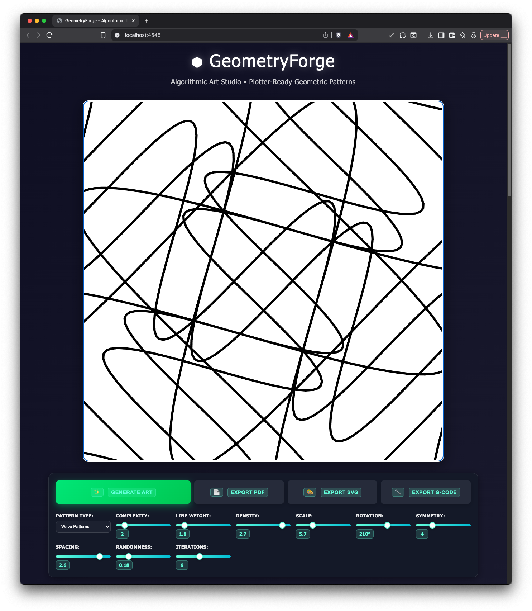

# GeometryForge - Algorithmic Art Studio

## ⚠️ **IMPORTANT DISCLAIMER**

> **🤖 AI-GENERATED SOFTWARE NOTICE**
> 
> This software was generated using artificial intelligence tools and automated coding assistants. While efforts have been made to ensure functionality and code quality:
> 
> - **⚡ Software may contain bugs or unexpected behavior**
> - **🔧 Features may not work as described**
> - **📋 Code may require debugging or modifications**
> - **🛠️ Use at your own risk for production purposes**
> - **🧪 Recommended for experimental and educational use**
> 
> **Please test thoroughly before relying on this software for critical applications.**



A powerful web-based algorithmic art generator that creates stunning geometric patterns with real-time parameter control and professional export capabilities for plotters and vector graphics.

🚀 **[Try it live at geometryforge.netlify.app](https://geometryforge.netlify.app/)**

## ✨ Features

### 🎨 **19 Algorithmic Patterns**
- **Cosmic**: Spiral Galaxy, Galaxy Arms, Constellation, Nebula, Orbital Systems
- **Natural**: Fractal Tree, Flower Petals, Snowflake, Wave Patterns, Flow Streams  
- **Geometric**: Grid Lines, Radial Lines, Crystal Formation, Lattice, Mandala
- **Scientific**: Molecular Structure, DNA Helix, Voronoi Diagram, Random Connections

### 🎛️ **Advanced Controls**
- **Pattern Selection**: 19 unique algorithmic patterns
- **Complexity**: Control detail level and intricacy
- **Line Weight**: Adjust stroke thickness
- **Density**: Control point/line density
- **Scale**: 0.1x to 20x scaling range
- **Rotation**: 360° rotation control
- **Symmetry**: 1-12x radial symmetry
- **Spacing**: Adjust element spacing
- **Randomness**: Add organic variation
- **Iterations**: Control pattern repetition

### 📁 **Professional Export Formats**
- **PDF**: High-quality print-ready output
- **SVG**: Scalable vector graphics with continuous paths
- **G-Code**: Plotter-ready machine code with optimized tool paths

### 🎯 **Plotter-Ready Output**
- Continuous path generation for minimal pen lifts
- Optimized G-code with proper feed rates and pen controls
- Mathematical precision for clean vector output
- Consistent scaling across all export formats

## 🚀 Getting Started

### Prerequisites
- Modern web browser (Chrome, Firefox, Safari, Edge)
- Python 3.x (for local server)

### Installation

1. **Clone the repository**
   ```bash
   git clone https://github.com/otoinsa/vector-art-gen.git
   cd vector-art-gen
   ```

2. **Start the local server**
   ```bash
   python3 server.py
   ```

3. **Open in browser**
   ```
   http://localhost:4545
   ```

## 🎮 Usage

### Creating Art
1. **Select a pattern** from the dropdown menu
2. **Adjust parameters** using the control sliders
3. **Generate new variations** with the "Generate New Art" button
4. **Fine-tune** with density, scale, rotation, and other controls

### Exporting
- **PDF Export**: Perfect for high-quality prints
- **SVG Export**: Ideal for further editing in vector graphics software
- **G-Code Export**: Ready for CNC plotters and drawing machines

### Pro Tips
- **Start with low complexity** and gradually increase for detailed patterns
- **Use symmetry** to create mandala-like designs
- **Combine high density with low randomness** for precise geometric patterns
- **Add randomness** for more organic, hand-drawn aesthetics

## 🛠️ Technical Details

### Built With
- **Processing.js**: Real-time canvas rendering
- **Vanilla JavaScript**: Lightweight and fast
- **CSS Grid**: Responsive control layout
- **Python**: Local development server

### Architecture
- **Modular pattern system**: Easy to add new algorithms
- **Unified parameter handling**: Consistent behavior across canvas, SVG, and G-code
- **Continuous path generation**: Optimized for plotters and vector output
- **Real-time updates**: Instant visual feedback

### G-Code Features
- Pen up/down commands (M3/M5)
- Optimized feed rates (drawing vs travel)
- Coordinate scaling and offset support
- Continuous path optimization
- Professional machine code structure

## 📐 Pattern Algorithms

Each pattern uses mathematical formulas to generate unique geometric designs:

- **Spiral**: Archimedean spiral with variable density
- **Galaxy**: Logarithmic spiral arms with perturbations
- **Nebula**: Parametric curves with sine/cosine variations
- **Mandala**: Radial symmetry with concentric elements
- **Tree**: Recursive branching with L-system principles
- **DNA**: Double helix with connecting base pairs
- **Voronoi**: Cell-based spatial partitioning
- **Wave**: Sinusoidal functions with harmonics

## 🎨 Dark Theme UI

GeometryForge features a sleek dark interface designed for extended creative sessions:
- **Compact bottom control panel** for maximum canvas space
- **Intuitive slider controls** with real-time feedback
- **Responsive design** adapting to different screen sizes
- **Professional color scheme** reducing eye strain

## 🤝 Contributing

Contributions are welcome! Here are some ways to help:

1. **Add new patterns**: Implement additional algorithmic designs
2. **Improve UI/UX**: Enhance the user interface and experience
3. **Optimize exports**: Further improve G-code and SVG generation
4. **Documentation**: Help improve this README and code comments

### Development Setup
```bash
# Fork the repository and clone your fork
git clone https://github.com/yourusername/vector-art-gen.git
cd vector-art-gen

# Make your changes
# Test thoroughly
# Create a pull request
```

## 📄 License

This project is open source and available under the [MIT License](LICENSE).

## 🙏 Acknowledgments

- **Processing.js community** for the excellent graphics library
- **Plotter artists** who inspired the G-code export functionality
- **Geometric art pioneers** who laid the mathematical foundations

## 🔗 Links

- **Live Demo**: [https://geometryforge.netlify.app/](https://geometryforge.netlify.app/)
- **Issues**: [GitHub Issues](https://github.com/otoinsa/vector-art-gen/issues)
- **Discussions**: [GitHub Discussions](https://github.com/otoinsa/vector-art-gen/discussions)

---

**Made with ❤️ for artists, makers, and geometry enthusiasts**

*Transform mathematical beauty into tangible art with GeometryForge*
